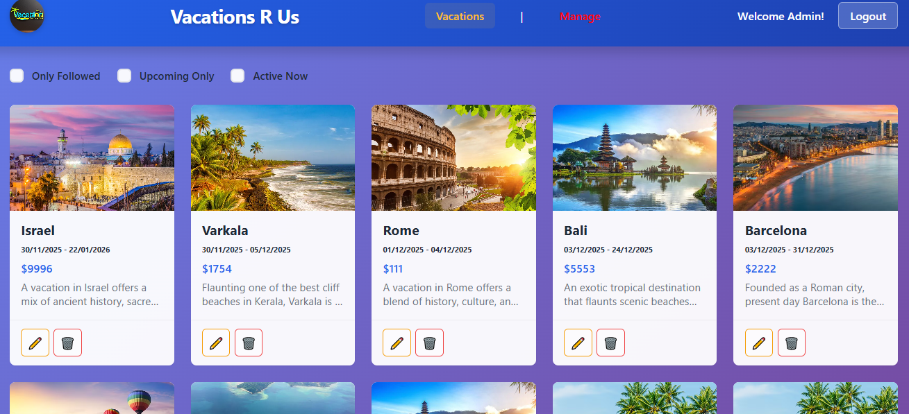

# Vacations Are Us

## 🚀 [Live Demo - View the App](https://michaelalonu.github.io/vercel-front)

## Overview

Vacations Are Us is a full-stack web application for managing and booking vacation packages.
The project demonstrates end-to-end development including authentication, role-based access control,
REST APIs, real-time communication, database design, and containerized deployment.

### Key Features
- JWT-based authentication and role-based authorization (User / Admin)
- Vacation browsing, filtering, and bookmarking
- Admin dashboard for vacation management (CRUD)
- Image uploads with AWS S3 (LocalStack for local development)
- Real-time updates using Socket.IO
- Responsive React-based UI

## Tech Stack Overview
React + TypeScript frontend, Node.js + Express backend, MySQL database,
real-time communication with Socket.IO, and full Dockerized environment.

### Backend
- **Runtime**: Node.js with TypeScript
- **Framework**: Express.js
- **Database**: MySQL with Sequelize ORM
- **Authentication**: JWT (JSON Web Tokens)
- **File Storage**: AWS S3 (with LocalStack for local development)
- **Validation**: Joi
- **API Documentation**: Postman collection included

### Frontend
- **Framework**: React
- **State Management**: Redux Toolkit
- **UI Components**: Custom CSS with Material Design themes
- **Form Handling**: React Hook Form with Joi validation
- **HTTP Client**: Axios
- **Real-time Communication**: Socket.IO Client
- **Build Tool**: Vite
- **Charts**: Recharts (for reports/analytics)

### DevOps
- **Containerization**: Docker & Docker Compose
- **Local S3**: LocalStack
- **Database**: MySQL in Docker

## Project Structure

```
├── backend/                 # Express.js REST API
│   ├── src/
│   │   ├── app.ts          # Main application entry
│   │   ├── controllers/    # Route controllers
│   │   ├── models/         # Sequelize models
│   │   ├── routers/        # Route definitions
│   │   ├── middlewares/    # Express middlewares
│   │   ├── aws/            # AWS S3 configuration
│   │   └── db/             # Database setup
│   ├── config/             # Configuration files
│   └── Dockerfile
├── frontend/               # React + Vite application
│   ├── src/
│   │   ├── components/     # React components
│   │   ├── pages/          # Page components
│   │   ├── services/       # API service calls
│   │   ├── hooks/          # Custom React hooks
│   │   ├── redux/          # Redux store & slices
│   │   └── models/         # TypeScript interfaces
│   ├── public/             # Static assets
│   └── Dockerfile
├── io/                     # Socket.IO server
│   └── src/
│       └── app.ts          # WebSocket server
├── database/               # MySQL database
│   └── vacations_are_us_db.sql  # Database schema
└── docker-compose.yaml     # Multi-container orchestration
```


## Getting Started

### Prerequisites

- Node.js 18+ (for local development)
- Docker & Docker Compose (for containerized deployment)
- MySQL 8.0+ (if running without Docker)
- AWS Account or LocalStack (for S3 file storage)

### Local Development Setup

#### 1. Clone the Repository
```bash
git clone <https://github.com/MichaelAlonU/Vacations-management-system-Project-3>
cd 45782-1-project-3
```

#### 2. Backend Setup
```bash
cd backend
npm install
npm run dev
```

The backend will start on `http://localhost:3000`

#### 3. Frontend Setup
```bash
cd frontend
npm install
npm run dev
```

The frontend will start on `http://localhost:5173`

#### 4. Database Setup

Create a MySQL database and run the schema:
```bash
mysql -u root < database/vacations_are_us_db.sql
```

Or use Docker:
```bash
docker run --name vacations-db -e MYSQL_ALLOW_EMPTY_PASSWORD=1 -e MYSQL_DATABASE=vacations_are_us_db -p 3306:3306 -d mysql:8.0
```

#### 5. LocalStack Setup (for S3)

LocalStack will be started automatically with Docker Compose, or install locally:
```bash
npm install -g localstack
localstack start
```

#### 6. Socket.IO Server Setup
```bash
cd io
npm install
npm run dev
```

The IO server will start on `http://localhost:3004`

### Docker Compose Deployment

Run the entire stack with Docker Compose:

```bash
docker-compose up --build
```

Services will be available at:
- Frontend: `http://localhost:3012`
- Backend API: `http://localhost:3020`
- Socket.IO: `http://localhost:3022`
- Database: `localhost:3309`
- LocalStack: `http://localhost:4566`

## API Endpoints

### Authentication
- `POST /auth/signup` - User registration
- `POST /auth/login` - User login
- `POST /auth/logout` - User logout

### Vacations
- `GET /vacations` - Get all vacations
- `POST /vacations` - Create vacation (admin only)
- `PUT /vacations/:id` - Update vacation (admin only)
- `DELETE /vacations/:id` - Delete vacation (admin only)

### Followers/Bookmarks
- `GET /followers` - Get user's bookmarked vacations
- `POST /followers/:vacationId` - Bookmark a vacation
- `DELETE /followers/:vacationId` - Remove bookmark

## Configuration

Environment-specific configurations are in `backend/config/`:
- `default.json` - Default development settings
- `docker.json` - Docker container settings
- `production.json` - Production settings
- `custom-environment-variables.json` - Environment variable mappings

Key configuration options:
```json
{
  "app": {
    "port": 3000,
    "name": "Vacations are us",
    "secret": "MySecret",
    "jwtSecret": "JwtVacSecret"
  },
  "db": {
    "host": "localhost",
    "port": 3306,
    "username": "root",
    "password": "",
    "database": "vacations_are_us_db"
  }
}
```

## Available Scripts

### Backend
- `npm run dev` - Start development server with hot reload
- `npm run build` - Compile TypeScript to JavaScript
- `npm start` - Run compiled application

### Frontend
- `npm run dev` - Start Vite development server
- `npm run build` - Build for production
- `npm run build:compose` - Build for Docker Compose
- `npm run qa` - Build for QA environment
- `npm run lint` - Run ESLint
- `npm run preview` - Preview production build

### IO Server
- `npm run dev` - Start development server

## Database Models

- **User**: User account information with roles
- **Role**: User roles (USER, ADMIN)
- **Vacation**: Vacation package details with pricing and images
- **Follow**: Bookmarked vacations for users

## Authentication & Authorization

The application uses JWT tokens for authentication:

1. User logs in with credentials
2. Server returns JWT token
3. Token is stored in localStorage on the client
4. Token is included in Authorization header for protected routes
5. Roles determine access to admin features

## File Upload

Images are uploaded to AWS S3 with the following flow:

1. User selects image in admin panel
2. Express FileUpload middleware processes the file
3. File is uploaded to S3 via AWS SDK
4. S3 object key is stored in the database

For local development, LocalStack provides an S3-compatible API endpoint.

## Error Handling

The application includes comprehensive error handling:

- Request validation with Joi
- Database transaction management
- HTTP error responses with status codes
- Error logging middleware
- Client-side error boundaries

## Development Workflow

1. Create a feature branch: `git checkout -b feature/your-feature`
2. Make changes and commit: `git commit -am 'Add new feature'`
3. Push to branch: `git push origin feature/your-feature`
4. Submit a pull request

## Testing

To run the backend in test mode:
```bash
cd backend
npm run build
npm start
```

## Troubleshooting

### Port Already in Use
```bash
# Kill process on port 3000 (Windows)
netstat -ano | findstr :3000
taskkill /PID <PID> /F

# Linux/Mac
lsof -i :3000
kill -9 <PID>
```

### Database Connection Error
- Ensure MySQL is running: `mysql --version`
- Check credentials in `backend/config/default.json`
- For Docker: `docker logs vacations-are-us-db-compose`

### S3 Upload Failures
- Verify LocalStack is running: `curl http://localhost:4566`
- Check AWS credentials in configuration
- Ensure bucket exists in S3

## Application View
Example of the application UI


## Links:
🚀 [Live Demo - View the App](https://michaelalonu.github.io/vercel-front)

## Author

Michael Uzan
